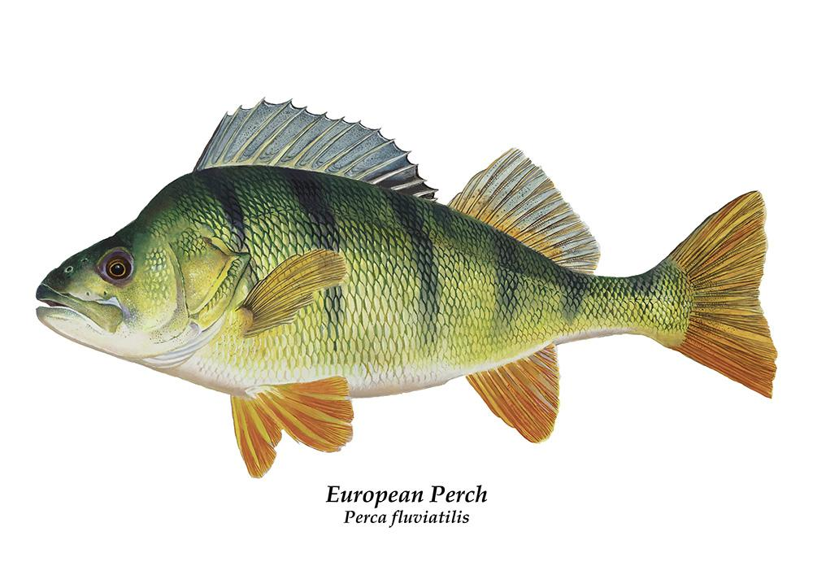

# European Perch

An API that Converts latitude,longitude to an OS map reference and an OS map reference to latitude,longitude

If you give it a latitude,longitude it'll tell you which OS map the point resides in, along with some metadata about the map and an OS map reference for the point.




European Perch is the HTTP wrapper for [Northern Pike](https://github.com/cookiescrumbs/northern-pike/)


## Development

```json
docker-compose up --build

http://localhost:4567/api/v1/os-ref/HU2600048999

{:lat=>60.22449375779038, :lng=>-1.5325017342359533}


http://localhost:4567/api/v1/lat/60.22449375779038/lng/-1.5325017342359533

{"os_ref":"HU 26000 48999","os_map":{"sheet":"467","url":"https://www.ordnancesurvey.co.uk/shop/explorer-map-shetland-mainland-central.html","title":"Shetland - Mainland Central","sub_title":"Lerwick, Papa Stour & Foula","series":"Explorer","images":["https://cdn11.bigcommerce.com/s-qc7qegnorm/images/stencil/50x50/products/2476/1456/467---Shetland-Mainland-Central---Explorer-Map---Cover__66955.1596791563.png?c=1","https://cdn11.bigcommerce.com/s-qc7qegnorm/images/stencil/50x50/products/2476/1457/467-Explorer-Map-Back-Shetland-Mainland-Central__87395.1596791563.png?c=1","https://cdn11.bigcommerce.com/s-qc7qegnorm/images/stencil/50x50/products/2476/4567/Explorer-467__28331.1602602794.png?c=1","https://cdn11.bigcommerce.com/s-qc7qegnorm/images/stencil/50x50/products/2476/5414/Explorer-467mapzoom__45562.1605025550.png?c=1","https://cdn11.bigcommerce.com/s-qc7qegnorm/images/stencil/50x50/products/2476/5776/Explorer-467.2mapzoom__95894.1605027635.png?c=1","https://cdn11.bigcommerce.com/s-qc7qegnorm/images/stencil/160w/products/2475/1454/466---Shetland-Mainland-South---Explorer-Map---Cover__39277.1596791559.png?c=1","https://cdn11.bigcommerce.com/s-qc7qegnorm/images/stencil/160w/products/2478/1460/469---Shetland-Mainland-North-West---Explorer-Map---Cover__81307.1596791572.png?c=1","https://cdn11.bigcommerce.com/s-qc7qegnorm/images/stencil/160w/products/2477/1458/468---Shetland-Mainland-North-East---Explorer-Map---Cover__64844.1596791568.png?c=1","https://cdn11.bigcommerce.com/s-qc7qegnorm/images/stencil/160w/products/2484/1471/4-Landranger-Map-Cover-Shetland-South-Mainland__85465.1596791597.png?c=1","https://cdn11.bigcommerce.com/s-qc7qegnorm/images/stencil/160w/products/2483/1469/3-Landranger-Map-Cover-Shetland-North-Mainland__58453.1596791593.png?c=1"],"bounding_box":[{"lat":60.10853048368655,"lng":-2.1277100267004725},{"lat":60.34756608353561,"lng":-1.041531933596803}]}}

```

## Usage

```json
https://still-waters-39747.herokuapp.com/api/v1/os-ref/HU2600048999

{:lat=>60.22449375779038, :lng=>-1.5325017342359533}

```
```json

https://still-waters-39747.herokuapp.com/api/v1/lat/60.22449375779038/lng/-1.5325017342359533


{"os_ref":"HU 26000 48999","os_map":{"sheet":"467","url":"https://www.ordnancesurvey.co.uk/shop/explorer-map-shetland-mainland-central.html","title":"Shetland - Mainland Central","sub_title":"Lerwick, Papa Stour & Foula","series":"Explorer","images":["https://cdn11.bigcommerce.com/s-qc7qegnorm/images/stencil/50x50/products/2476/1456/467---Shetland-Mainland-Central---Explorer-Map---Cover__66955.1596791563.png?c=1","https://cdn11.bigcommerce.com/s-qc7qegnorm/images/stencil/50x50/products/2476/1457/467-Explorer-Map-Back-Shetland-Mainland-Central__87395.1596791563.png?c=1","https://cdn11.bigcommerce.com/s-qc7qegnorm/images/stencil/50x50/products/2476/4567/Explorer-467__28331.1602602794.png?c=1","https://cdn11.bigcommerce.com/s-qc7qegnorm/images/stencil/50x50/products/2476/5414/Explorer-467mapzoom__45562.1605025550.png?c=1","https://cdn11.bigcommerce.com/s-qc7qegnorm/images/stencil/50x50/products/2476/5776/Explorer-467.2mapzoom__95894.1605027635.png?c=1","https://cdn11.bigcommerce.com/s-qc7qegnorm/images/stencil/160w/products/2475/1454/466---Shetland-Mainland-South---Explorer-Map---Cover__39277.1596791559.png?c=1","https://cdn11.bigcommerce.com/s-qc7qegnorm/images/stencil/160w/products/2478/1460/469---Shetland-Mainland-North-West---Explorer-Map---Cover__81307.1596791572.png?c=1","https://cdn11.bigcommerce.com/s-qc7qegnorm/images/stencil/160w/products/2477/1458/468---Shetland-Mainland-North-East---Explorer-Map---Cover__64844.1596791568.png?c=1","https://cdn11.bigcommerce.com/s-qc7qegnorm/images/stencil/160w/products/2484/1471/4-Landranger-Map-Cover-Shetland-South-Mainland__85465.1596791597.png?c=1","https://cdn11.bigcommerce.com/s-qc7qegnorm/images/stencil/160w/products/2483/1469/3-Landranger-Map-Cover-Shetland-North-Mainland__58453.1596791593.png?c=1"],"bounding_box":[{"lat":60.10853048368655,"lng":-2.1277100267004725},{"lat":60.34756608353561,"lng":-1.041531933596803}]}}

```

## Deployment

```bash
heroku login

heroku container:login

docker build -t european-perch:latest .

docker tag european-perch:latest registry.heroku.com/still-waters-39747/web

docker push registry.heroku.com/still-waters-39747/web

heroku container:release web
```

## Contributing
Bug reports and pull requests are welcome on GitHub at https://github.com/cookiescrumbs/perch.

## License
This code is free to use under the terms of the MIT license.
